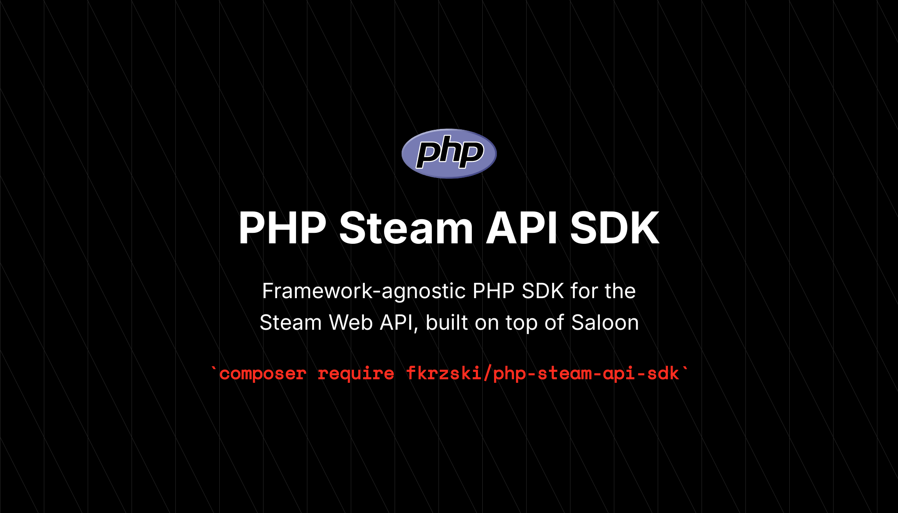

# PHP Steam API SDK



[](https://packagist.org/packages/fkrzski/php-steam-api-sdk)
[](https://packagist.org/packages/fkrzski/php-steam-api-sdk)
[](https://packagist.org/packages/fkrzski/php-steam-api-sdk)
[](https://github.com/fkrzski/php-steam-api-sdk/actions/workflows/tests.yml)

Framework-agnostic PHP SDK for the [Steam Web API](https://steamcommunity.com/dev), built on top of [Saloon](https://docs.saloon.dev/) v4.

- Strong types (PHP 8.5, PHPStan max, 100% type coverage).
- Readonly DTOs with `DateTimeImmutable` instead of framework date objects.
- Domain exception hierarchy rooted at `SteamApiException`.
- Daily 100 000-request rate limit baked in via [`saloonphp/rate-limit-plugin`](https://github.com/saloonphp/rate-limit-plugin).
- Zero framework coupling — a Laravel bridge package ships separately.

## Requirements

- PHP **8.5+**
- Saloon **4+**

## Installation

```bash
composer require fkrzski/php-steam-api-sdk
```

## Quickstart

```php
use Fkrzski\SteamApiSdk\Http\Requests\GetPlayerSummariesRequest;
use Fkrzski\SteamApiSdk\SteamConfig;
use Fkrzski\SteamApiSdk\SteamConnector;
use Fkrzski\SteamApiSdk\ValueObjects\SteamId;

$connector = new SteamConnector(new SteamConfig(apiKey: 'YOUR_STEAM_API_KEY'));

$summaries = $connector
    ->send(new GetPlayerSummariesRequest([SteamId::fromSteamId64('76561198000000000')]))
    ->dto();

echo $summaries[0]->personaName;
```

Every `Request::createDtoFromResponse()` returns a readonly DTO — call `->dto()` on the Saloon response to get it.

## Value object: `SteamId`

`SteamId` is the only accepted identifier across the SDK. Build one from a verified 64-bit ID, or try to parse user input:

```php
use Fkrzski\SteamApiSdk\ValueObjects\SteamId;

// Strict — throws InvalidSteamIdException when the input is not a 17-digit numeric ID.
$id = SteamId::fromSteamId64('76561198000000000');

// Lenient — returns null when the input is not a SteamID64 or /profiles/<id> URL.
$id = SteamId::tryFromInput('https://steamcommunity.com/profiles/76561198000000000');

// Extract the slug from /id/<name> URLs (or trim raw input). Resolve it via ResolveVanityUrlRequest.
$vanity = SteamId::extractVanityName('https://steamcommunity.com/id/gabelogannewell/');
```

## Available requests

### Resolve a vanity URL

```php
use Fkrzski\SteamApiSdk\Exceptions\SteamUserNotFoundException;
use Fkrzski\SteamApiSdk\Http\Requests\ResolveVanityUrlRequest;

try {
    $steamId = $connector->send(new ResolveVanityUrlRequest('gabelogannewell'))->dto();
} catch (SteamUserNotFoundException) {
    // The vanity slug does not exist.
}
```

### Player summaries (batch, ≤100 IDs)

```php
use Fkrzski\SteamApiSdk\Exceptions\TooManySteamIdsException;
use Fkrzski\SteamApiSdk\Http\Requests\GetPlayerSummariesRequest;

$summaries = $connector->send(new GetPlayerSummariesRequest([$steamId]))->dto();

foreach ($summaries as $summary) {
    echo $summary->personaName, ' — ', $summary->profileUrl, PHP_EOL;
}
```

Passing more than 100 IDs throws `TooManySteamIdsException`.

### Owned games

```php
use Fkrzski\SteamApiSdk\Exceptions\ProfileNotPublicException;
use Fkrzski\SteamApiSdk\Http\Requests\GetOwnedGamesRequest;

try {
    $library = $connector->send(new GetOwnedGamesRequest(
        steamId: $steamId,
        appIdsFilter: [381210],     // optional
        includeAppInfo: true,       // optional
        includePlayedFreeGames: false,
    ))->dto();
} catch (ProfileNotPublicException) {
    // The profile (or its games list) is hidden.
}
```

### User stats for a single game

```php
use Fkrzski\SteamApiSdk\Http\Requests\GetUserStatsForGameRequest;

$stats = $connector->send(new GetUserStatsForGameRequest(
    steamId: $steamId,
    appId: 381210,
    language: 'english', // optional; localises achievement metadata
))->dto();

foreach ($stats->stats as $stat) {
    echo $stat->name, ' = ', $stat->value, PHP_EOL;
}
```

### Player achievements

```php
use Fkrzski\SteamApiSdk\Http\Requests\GetPlayerAchievementsRequest;

$achievements = $connector->send(new GetPlayerAchievementsRequest(
    steamId: $steamId,
    appId: 381210,
    language: 'english',
))->dto();

foreach ($achievements->achievements as $achievement) {
    echo $achievement->apiName, ' — ', $achievement->achieved ? 'unlocked' : 'locked', PHP_EOL;
}
```

## Rate limiting

The Steam Web API allows **100 000 requests per API key per day**. The connector enforces this through `saloonphp/rate-limit-plugin` and throws `SteamRateLimitException` once the budget is exhausted.

By default the limit is tracked in an in-memory `MemoryStore`, which only spans a single PHP process. For multi-process deployments (queue workers, FPM pools) inject a shared store:

```php
use Fkrzski\SteamApiSdk\SteamConfig;
use Fkrzski\SteamApiSdk\SteamConnector;
use Saloon\RateLimitPlugin\Stores\PredisStore;

$connector = new SteamConnector(new SteamConfig(
    apiKey: 'YOUR_STEAM_API_KEY',
    rateLimitStore: new PredisStore($predis),
));
```

Any implementation of `Saloon\RateLimitPlugin\Contracts\RateLimitStore` is accepted (Predis, PSR-16, file, Laravel cache, custom).

## Exception hierarchy

```
SteamApiException                (root, extends RuntimeException)
├── InvalidSteamIdException      Malformed SteamID64.
├── SteamUserNotFoundException   Vanity URL unresolved or profile missing.
├── ProfileNotPublicException    Profile / games list / stats are private.
├── TooManySteamIdsException     More than 100 IDs in a batch request.
└── SteamRateLimitException      100k/day quota reached; exposes the offending Limit.
```

Catch the root `SteamApiException` to handle every SDK failure uniformly.

## Testing

The SDK uses Pest with Saloon's `MockClient` and recorded JSON fixtures in `tests/Fixtures/Saloon/`.

```bash
composer test          # lint + phpstan + pest (100% coverage)
composer test:unit     # pest only
composer test:types    # phpstan max
composer test:lint     # pint + rector dry-run
```

## License

MIT. See [LICENSE.md](LICENSE.md).
