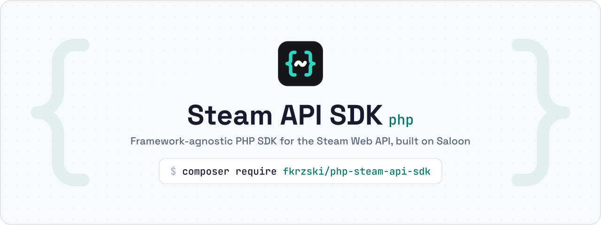

# PHP Steam API SDK

<picture>
  <source media="(prefers-color-scheme: dark)" srcset="art/banner-dark.svg">
  
</picture>

[](https://packagist.org/packages/fkrzski/php-steam-api-sdk)
[](https://packagist.org/packages/fkrzski/php-steam-api-sdk)
[](https://packagist.org/packages/fkrzski/php-steam-api-sdk)
[](https://github.com/fkrzski/php-steam-api-sdk/actions/workflows/tests.yml)

Framework-agnostic PHP SDK for the [Steam Web API](https://steamcommunity.com/dev), built on top of [Saloon](https://docs.saloon.dev/) v4.

It powers the player profiles on [Dead by Stats](https://deadbystats.eu).

- Fluent resources on the connector — `$connector->players()->ownedGames($id)`.
- Strong types (PHP 8.5, PHPStan max, 100% type coverage).
- Readonly DTOs with `DateTimeImmutable` instead of framework date objects.
- Domain exception hierarchy rooted at `SteamApiException`.
- Daily 100 000-request rate limit baked in via [`saloonphp/rate-limit-plugin`](https://github.com/saloonphp/rate-limit-plugin), reset at 00:00 UTC, or limits of your own through `rateLimits`.
- Timeouts and opt-in retries on `SteamConfig` — only a `5xx` or no answer at all is retried, since every attempt spends quota.
- Request, response and failure hooks with key-free payloads, and `debug()` output with the key masked.
- Requests of your own for methods the SDK does not ship, sent with the key, the budget and SDK exceptions.
- Zero framework coupling — any Saloon `Sender` in place of Guzzle, and a [Laravel bridge package](https://docs.fkrzski.dev/laravel-steam-api-sdk) ships separately.

## Requirements

- PHP **8.5+**
- Saloon **4+**

## Installation

```bash
composer require fkrzski/php-steam-api-sdk
```

## Quickstart

```php
use Fkrzski\SteamApiSdk\SteamConfig;
use Fkrzski\SteamApiSdk\SteamConnector;
use Fkrzski\SteamApiSdk\ValueObjects\SteamId;

$connector = new SteamConnector(new SteamConfig(apiKey: 'YOUR_STEAM_API_KEY'));

$summaries = $connector->users()->summaries([SteamId::fromSteamId64('76561198000000000')]);

echo $summaries[0]->personaName;
```

## Documentation

Full documentation — every request, the `SteamId` value object, configuration, rate limiting, DTOs, the exception hierarchy, debugging hooks and custom requests — lives at **[docs.fkrzski.dev/php-steam-api-sdk](https://docs.fkrzski.dev/php-steam-api-sdk)**.

## License

MIT. See [LICENSE.md](LICENSE.md).
